# 大话数据结构

**开场白**：如果你交给某个人一个程序，你将折磨他一整天；如果你教某人如何编写程序，你将折磨他一辈子。

## 第一章：数据结构绪论

**数据结构**：研究非数值计算的程序设计问题中的操作对象，以及以及它们之间的关系和操作等相关问题的学科。

程序设计=数据结构+算法。

### 1.1 基本术语和概念

#### 1.1.1数据

**数据**：描述客观事物的符号，是计算机可以操作的对象，是能被计算机识别，并输入给计算机处理的符号集合。不仅仅包括整型、实型等数据类型，还包括字符及声音、图像、视频等非数值类型。

数据就是==符号==，符号必须具备两个前提：

+ 可以输入到计算机中
+ 能被计算机程序处理
  
#### 1.1.2数据元素

**数据元素**：是组成数据的、有一定意义的==基本单位==，在计算机中通常作为整体处理，也被称为记录。（人类中人为数据元素，畜禽类中牛马为数据元素）

#### 1.1.3 数据项

**数据项**：一个数据元素可由若干个数据项组成。（属性）

#### 1.1.4 数据对象

**数据对象**：是性质相同的数据元素的集合，是数据的子集。

#### 1.1.5 数据结构

**结构**：不同数据元素之间不是独立的，而是存在特定的关系，我们将这些关系称为结构。

**数据结构**：是相互之间存在一种或多种关系的数据元素的集合。

### 1.2 逻辑结构与物理结构

按照视点的不同将数据结构分为逻辑结构和物理结构。

#### 1.2.1逻辑结构

**逻辑结构**：数据对象中数据元素之间的相互关系，分为以下4个关系：

+ **集合结构**：集合结构中的数据元素只有同属于一个集合这一个关系。
  
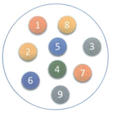

+ **线性结构**：线性结构中的数据元素之间是一对一的关系。
  
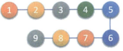

+ **树形结构**：树形结构中的数据元素之间存在一对多的层次关系。
  
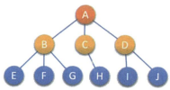

+ **图形结构**：图形结构的数据元素是多对多的关系。
  
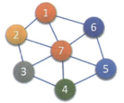

#### 1.2.2 物理结构

**物理结构**：是指数据的逻辑结构在计算机中的存储形式。（存储结构）

**顺序存储结构**：把数据元素放在地址连续的存储单元里，其数据间的逻辑关系和物理关系一致。

**链式存储结构**：把数据元素放在任意的存储单元里。（需要指针存放数据元素的位置）

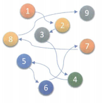

**注**：逻辑结构是==面向问题==的，物理结构是==面向计算机==的。

### 1.3 数据类型

**数据类型**：是指一组性质相同的值的集合及定义在此集合上的一些操作的总称。

#### 1.3.1 数据类型的分类

在C语言中，按照取值的不同，数据类型可分为两类：

+ **原子类型**：不可以再分解的基本类型，包括整型、实型、字符型等。

+ **结构类型**：由若干类型组合而成，例：整形数组由若干整形数据组成。
  
#### 1.3.2 抽象数据类型

**抽象**：抽取出事物具有的普遍性本质，隐藏繁杂的细节并保留实现目标所必需的信息。

**抽象数据类型（Abstract Data Type ，ADT）**：一个数学模型及定义在该模型上的一组操作。

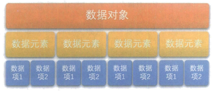

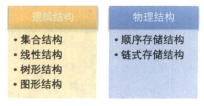

## 第二章 算法

**算法**：算法是解决特定问题求解步骤的描述，在计算机中表现为指令的有限序列，并且每条指令表示一个或多个操作。

### 2.1 数据结构与算法的关系

《罗密欧》与《朱丽叶》

### 2.2 算法的特性

算法具有五个基本特性：输入、输出、有穷性、确定性和可行性。

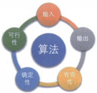

#### 2.2.1 输入输出

算法有==零个或多个==**输入**，==至少一个==**输出**。

#### 2.2.2 有穷性

**有穷性**：算法在执行有限的步骤后，自动结束而不出现无限循环，并且每个步骤都在可接受时间内完成。

#### 2.2.3 确定性

**确定性**：每个算法的每个步骤都有确定的含义，不会出现二义性。

#### 2.2.4 可行性

**可行性**：算法的每一步都必须是可行的，都能通过执行有限次完成。

### 2.3 算法设计的要求

算法不是唯一的，但有相对好的算法。那么怎样算相对好的算法呢？

算法设计有以下四点要求：正确性、可读性 、健壮性、时间效率高和存储量低。

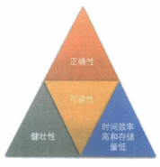

#### 2.3.1 正确性

**正确性**：算法的正确性指算法至少应该具有输入、输出和加工处理无歧义性，能正确反映问题的需求，得到问题正确答案，大体分为以下四个层次：

+ 算法程序没有语法错误。
+ 算法程序对于合法的输入数据能够产生满足要求的输出结果。
+ 算法程序对于非法的输入数据能得出满足规格说明的结构。
+ 算法程序对于任何测试数据都得到满足要求的输出结果。
  
第四点是很困难的，因此达到第三点我们便称之为好的算法

#### 2.3.2 可读性

**可读性**：便于阅读、理解和交流。

#### 2.3.3 健壮性

**健壮性**：当输入数据不合法时，算法能做出相关处理，而不是产生异常或莫名其妙的结果。

#### 2.3.4 时间效率高和存储量低

设计算法应计量满足==时间效率高==和==存储量低==。

### 2.4 算法效率的度量方法

算法设计提高效率即缩短执行时间，其度量方法有事后统计方法、事前分析估算方法

#### 2.4.1 事后统计方法

**事后统计方法**：这种方法主要是通过设计好的测试程序和数据，利用计算机计时器对不同算法编制的程序的运行时间进行比较，从而确定算法效率的高低。

这种方法的缺陷：

+ 必须依据算法事先编制好程序，这通常需要花费大量的时间和精力。如果编制后发现算法不合理,之前所做工作毫无意义。
+ 不同的环境会对结果有影响。
+ 算法测试数据困难，测试数据类型和规模不好掌握。
  
基于以上的问题通常不采用这种方法。

#### 2.4.2 事前分析估算方法

**事前分析估算方法**：在计算机程序编制前，依据统计方法对算法进行估算。

经过分析，我们发现，一个用高级程序语言编写的程序在计算机上运行时所消耗的时间取决于下列因素：

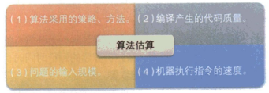

(1)算法采用的策略、方法。

(2)编译产生的代码质量。

(3)问题的输入规模。

(4)机器执行指令的速度。

抛开与计算机及软硬件有关的因素，一个程序的运行时间，依赖于==算法的好坏和问题的输入规模==。所谓问题输入规模是指==输入量==的多少。

分析一个算法的运行时间时，重要的是把==基本操作的数量==与==输入==关联起来，即基本操作的数量必须表示成输入规模的函数。

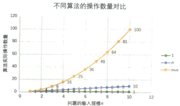

**理论依据**：某个算法，随着n 的增大，它会越来越优于另一算法，或者越来越差于另一算法。

### 2.5 函数的渐近增长

**函数的渐近增长**：给定两个函数f(n)和g(n), 如果存在一个整数N, 使得对于所有的n>N,f(n)总是比g(n)大,那么,我们说f(n)的增长渐近快于g(n)。

**判断一个算法的效率时**:函数中的常数和其他次要项常常可以忽略，而更应该关注==主项(最高阶项)的阶数==。

### 2.6 算法时间复杂度

#### 2.6.1算法时间复杂度的定义

**算法的时间复杂度**:也就是算法的时间量度，记作T(n)=O(f(n))。它表示随问题规模n的增大，算法执行时间的增长率和f(n)的增长率相同，称作算法的渐近时间复杂度，简称为时间复杂度。其中f(n)是
问题规模n的某个函数。

**大O记法**：大写O（）来体现算法时间复杂度。

一般情况下，随着n的增大，==T（n）增长最慢==的算法为最优算法。

askdj
