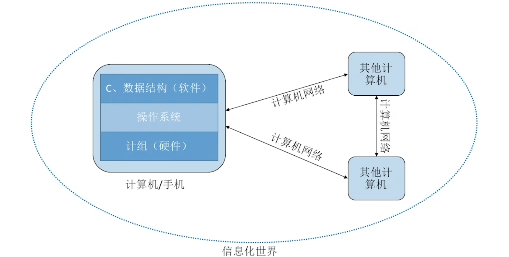
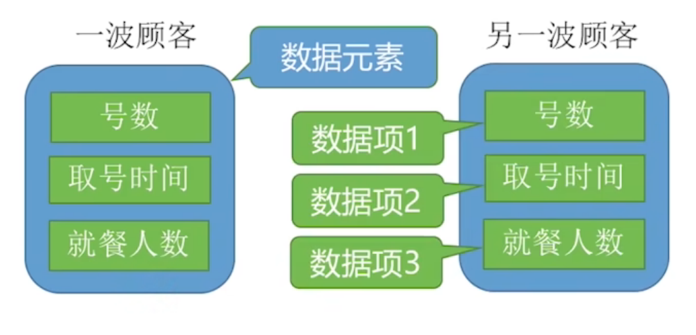
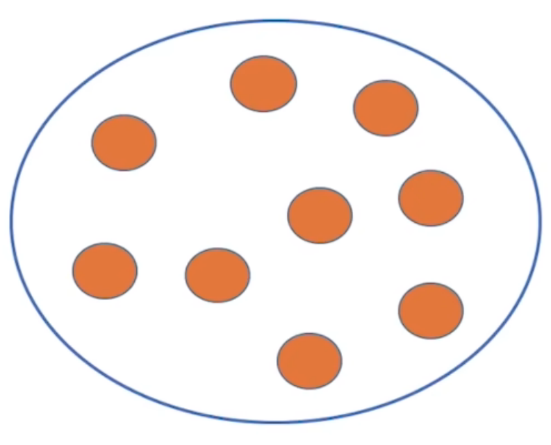
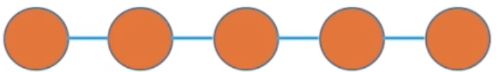
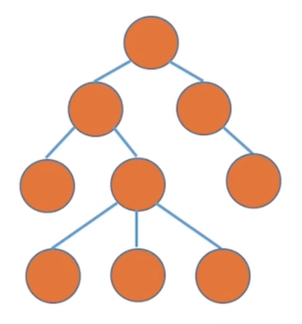
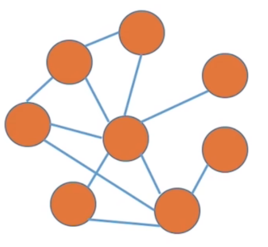

# 数据结构

数据结构在学什么？

+ 如何用程序代码把现实世界的问题信息化
+ 如何用计算机高效地处理这些信息从而创造价值

“唯一可以确定的是，明天会使我们所有人大吃一惊。” —— 阿尔文·托夫勒
(The sole certainty is that tomorrow will surprise us all.)

## 第一章 绪论

### 数据结构的基本概念

#### 数据

+ **数据**：数据是信息的载体，是描述客观事物属性的数、字符及所有能输入到计算机中并被计算机程序识别和处理的符号的集合。数据是计算机程序加工的原料

#### 数据元素、数据项

要根据实际的业务需求来确定什么是数据元素、什么是数据项

+ **数据元素**：是数据的基本单位，通常作为一个整体进行考虑和处理
+ **数据项**：是构成数据元素的不可分割的最小单位；一个数据元素可由若干数据项组成

#### 数据结构、数据对象

+ **数据结构**：是相互之间存在一种或多种特定**关系**的数据元素的集合

+ **数据对象**：是具有**相同性质**的数据元素的集合，是数据的一个子集

### 数据结构的三要素

#### 逻辑结构

**数据元素**之间的逻辑关系是什么

+ 集合
+ 线性结构
+ 树形结构
+ 图状结构

##### 集合

+ **集合**：数据元素之间不存在任何关系，集合中的数据元素是互不相关的

##### 线性结构

**线性结构**：数据元素之间是一对一的关系，除了第一个元素，所有元素都有唯一前驱，除了最后一个元素，所有元素都有唯一后继

##### 树形结构

**树形结构**：数据元素之间是一对多的关系

##### 图状结构

**图状结构**：数据元素之间是多对多的关系

#### 物理结构（存储结构）

如何用计算机表示数据元素的逻辑关系

+ 顺序结构
+ 链式结构
+ 索引结构
+ 散列结构

1.若采用顺序存储，则各个数据元素在物理上必须是连续的；若采用非顺序存储，则各个数据元素在物理上可以是离散的。

2.数据的存储结构会影响存储空间分配的方便程度

3.数据的存储结构会影响对数据运算的速度

#### 数据的运算

施加在数据上的运算包括运算的定义和实现。**运算的定义**：针对**逻辑结构**，指出运算的功能；**运算的实现**：针对**存储结构**，指出运算的具体操作步骤

### 数据类型和抽象数据类型

#### 数据类型

数据类型是一个**值的集合**和定义在此集合上的一组**操作**的总称

+ **原子类型**：其值不可再分的数据类型

+ **结构类型**：其值可以再分解为若干成分（分量）的数据类型

#### 抽象数据类型

**抽象数据类型** (Abstract Data Type, ADT)：抽象数据组织及与之相关的操作，不关心物理结构

### 算法

程序=数据结构+算法

**算法**（Algorithm）：是对特定问题求解步骤的一种描述，它是指令的有限序列，其中的每条指令表示一个或多个操作 &emsp;**即求解问题的步骤**

#### 算法的时间复杂度

**时间复杂度**：评估算法时间开销

$ T(n) $:时间开销

##### 大O表示法（Big O Notation）

大O表示“同阶”，同等数量级。即：当 $n \to \infty$ 时，二者之比为常数

示例：

+ $T_1(n) = O(n)$

+ $T_2(n) = O(n^2)$

+ $T_3(n) = O(n^3)$

###### 大O表示法的运算规则

+ a）加法规则

$T(n) = T_1(n) + T_2(n) = O(f(n)) + O(g(n)) = O(\max(f(n), g(n)))$
> 多项相加，只保留最高阶的项，且系数变为 1

+ b）乘法规则

$T(n) = T_1(n) \times T_2(n) = O(f(n)) \times O(g(n)) = O(f(n) \times g(n))$
> 多项相乘，都保留

**Eg：** $T_3(n) = n^3 + n^2\log_2n$

###### 常见时间复杂度的阶数比较

$$
O(1) < O(\log_2 n) < O(n) < O(n\log_2 n) < O(n^2) < O(n^3) < O(2^n) < O(n!) < O(n^n)
$$

> 常对幂指阶

##### 时间复杂度的三种情况

1.**最坏时间复杂度**：最坏情况下算法的时间复杂度
  
2.**平均时间复杂度**：所有输入示例等概率出现的情况下，算法的期望运行时间

3.**最好时间复杂度**：最好情况下算法的时间复杂度

#### 算法的空间复杂度

+ **空间复杂度（Space Complexity）**：无论问题规模怎么变，算法运行所需的内存空间都是固定的常量，算法空间复杂度为：

$$
S(n) = O(1)
$$
注：S 表示 "Space"（对应时间复杂度 $T(n)$，T 表示 "Time"）

**算法原地工作**：算法所需内存空间为常量