# 计算机组成原理

## 第一章 计算机系统概述

### 计算机的发展历程

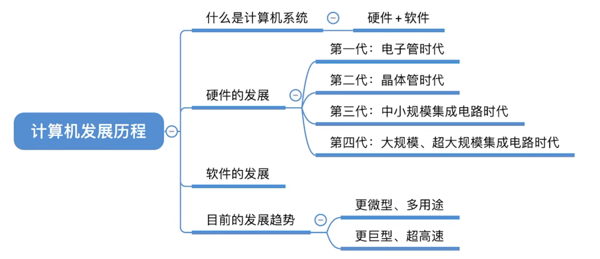

#### 什么是计算机系统

计算机系统=硬件+软件

+ 硬件：计算机的实体（看得见摸得着），如主机、外设等
+ 软件：用户使用（看不见摸不着），由具有各种特殊功能的程序组成

>计算机功能的好坏取决于软硬件功能的总和

#### 硬件的发展

+ 电子管时代
+ 晶体管时代
+ 中小规模集成电路时代
+ 大规模、超大规模集成电路时代

**机器字长**：指计算机一次整数运算能处理的二进制数的位数

**摩尔定律**：

+ 揭示了信息技术进步的速度
+ 集成电路上可容纳的晶体管数目，约每隔 **18个月** 便会增加一倍，整体性能也将提升一倍

#### 软件的发展

### 计算机硬件的基本组成

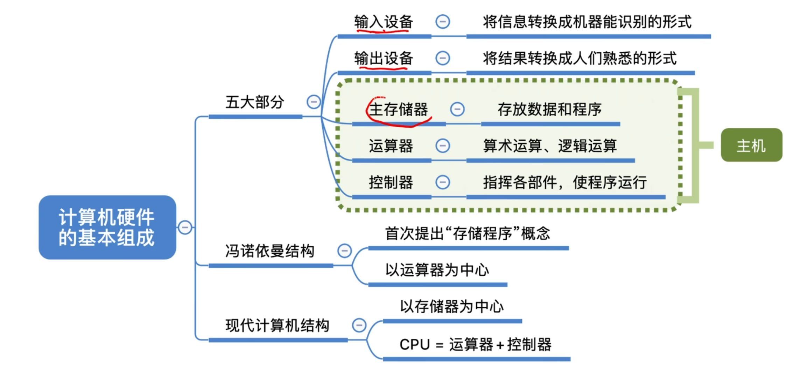

+ 早期冯诺依曼结构
+ 现代计算机结构

#### 存储程序

**存储程序**：将指令以二进制代码的形式事先输入计算机的主存储器（内存），然后按其在存储器中的首地址执行程序的第一条指令，以后就按该程序的规定顺序执行其他指令，直至程序执行结束

#### 早期冯诺依曼机

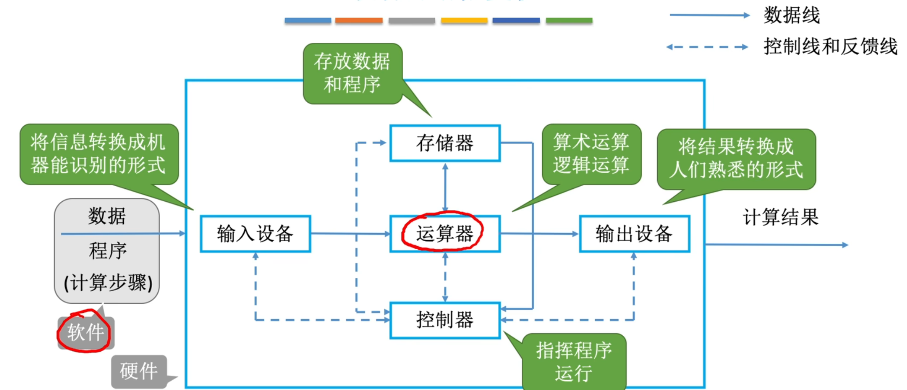

> 计算机系统中软件和硬件是等效的

##### 冯诺依曼机的特点

1. 计算机由五大部件组成（运算器、控制器、存储器、输入设备、输出设备）
2. 指令和数据以同等地位存于存储器，可按地址寻访
3. 指令和数据用二进制表示
4. 指令由操作码和地址码组成
5. 存储程序
6. 以**运算器**为中心

#### 现代计算机

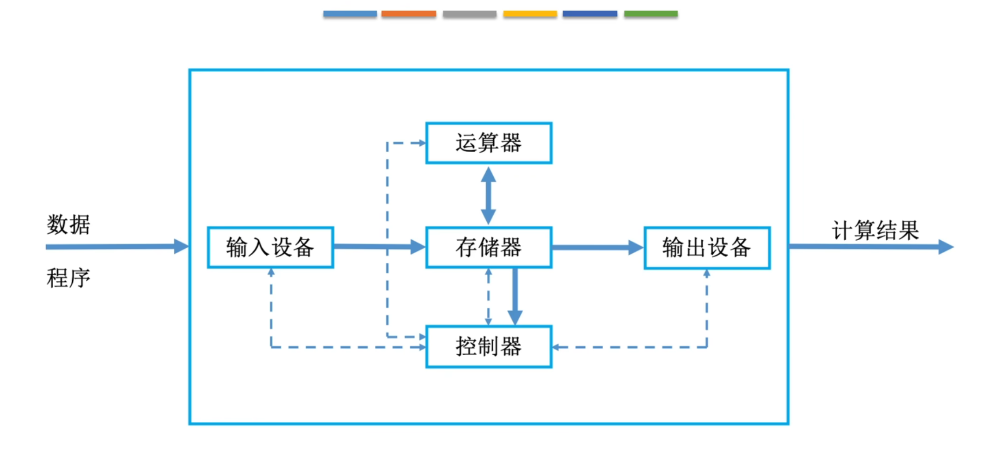

以**存储器**为中心

##### cpu=运算器+控制器

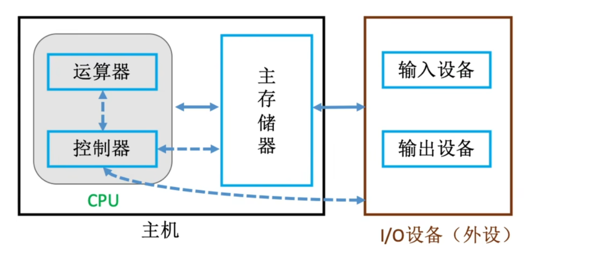

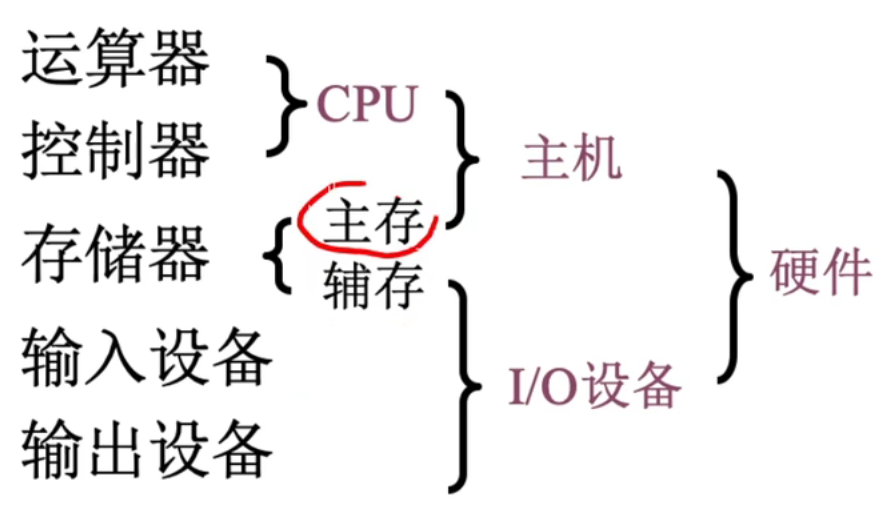

### 各个硬件的工作原理

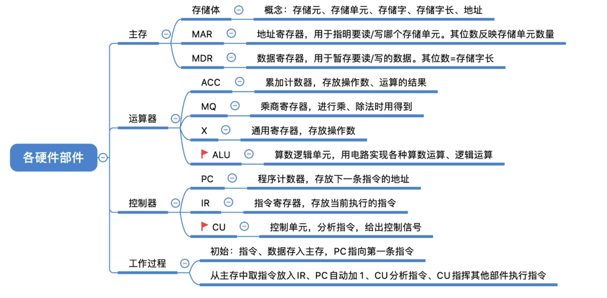

#### 主存储器

+ 存储体
+ MAR：位数反应存储单元的个数
+ MDR：位数等于存储字长

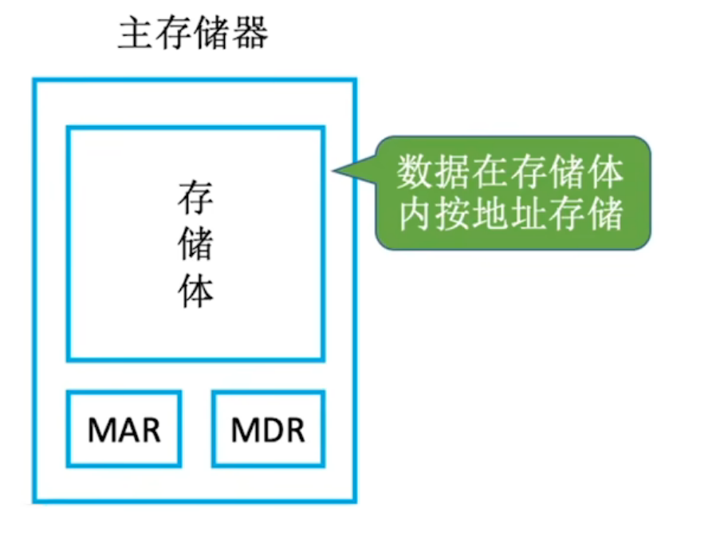

##### 存储体

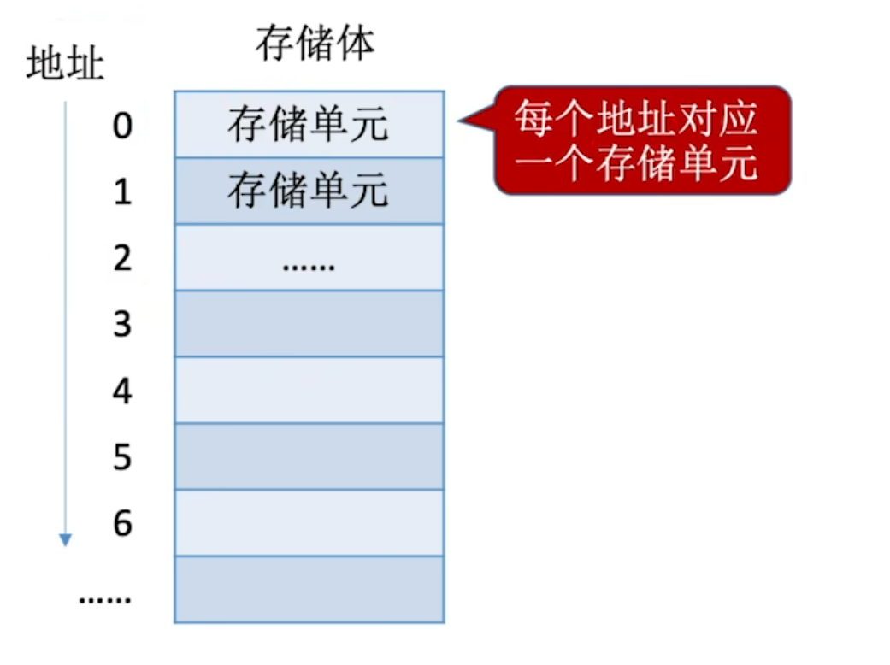

+ **存储单元**：每个存储单元存放一串二进制代码
+ **存储字 (word)**：存储单元中二进制代码的组合（代表一个数据或指令）
+ **存储字长**：存储单元中二进制代码的位数
+ **存储元**：即存储二进制的电子元件（电容），每个存储元可存 1 bit

##### 运算器

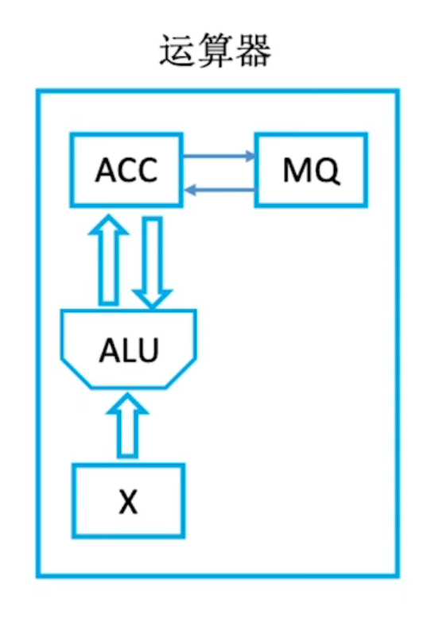

**运算器**：用于实现算术运算（如：加减乘除）、逻辑运算（如：与或非）

+ **ACC（累加器）**：用于存放操作数，或运算结果
+ **MQ（乘商寄存器）**：在乘、除运算时，用于存放操作数或运算结果
+ **X（通用操作数寄存器）**：通用的操作数寄存器，用于存放操作数
+ **ALU（算术逻辑单元）**：通过内部复杂的电路实现算数运算、逻辑运算

##### 控制器

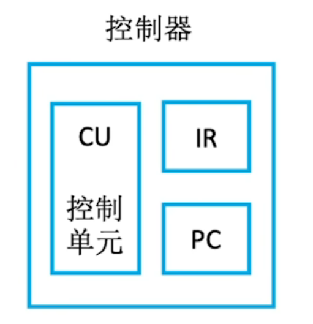

+ **CU（控制单元）**：分析指令，给出控制信号&emsp;**执行指令**
+ **IR（指令寄存器）**：存放当前执行的指令&emsp;**分析指令**
+ **PC（程序计数器）**：存放下一条指令地址，有自动加1功能 &emsp;**取指令**

#### 计算机的工作过程

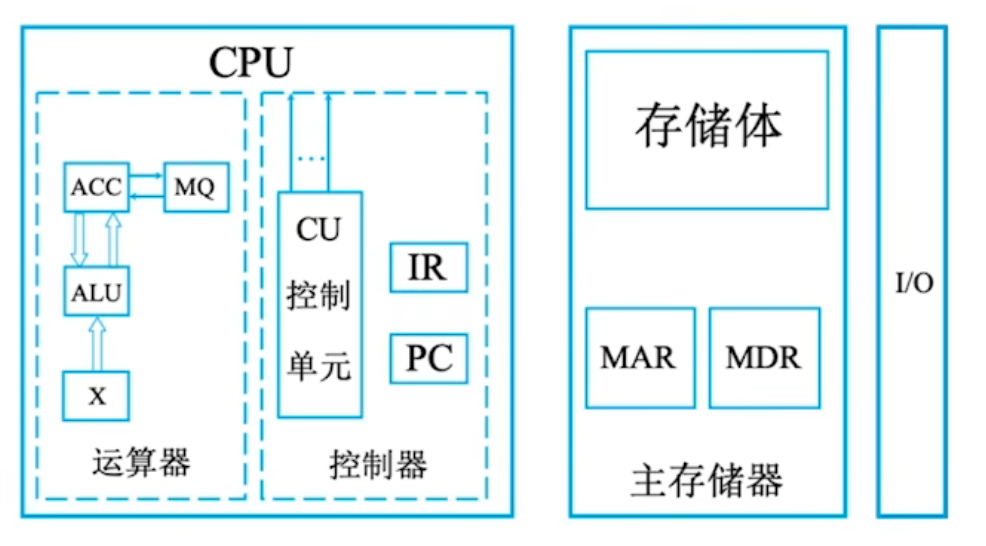

>ALU CU 为核心部件

### 计算机软件

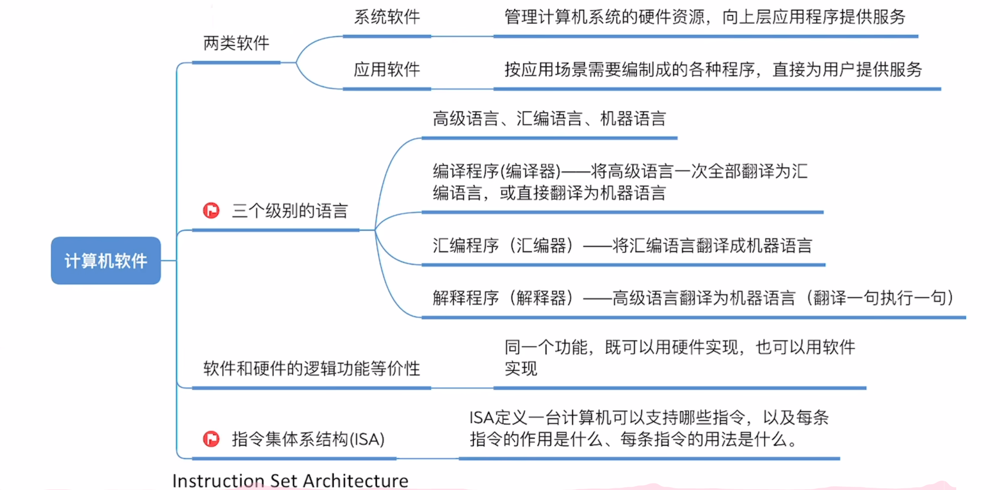

+ 系统软件：管理整个计算机系统
+ 应用软件：用户根据任务需要编制的各种程序

**软件和硬件的逻辑功能等价性**：同一个功能，既可以用硬件实现（性能高，成本高），也可以用软件实现（性能低，成本也低）

+ **指令集体系结构(ISA)**：软件和硬件之间的界面。设计计算机系统的ISA，就是要定义一台计算机可以支持哪些指令，以及每条指令的作用是什么、每条指令的用法是什么

### 计算机系统的层次结构

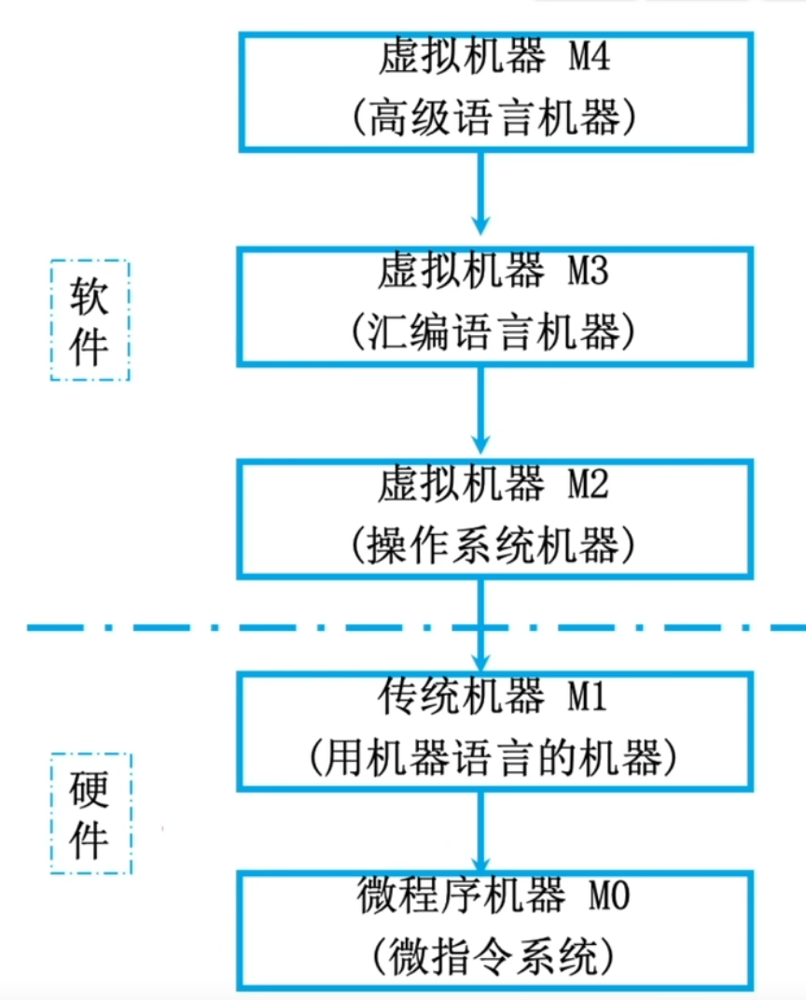

+ 应用语言虚拟机M5(面向问题的应用语言)：应用程序包翻译到M4上
+ 虚拟机器M4（高级语言机器）：用编译程序翻译成汇编语言程序
+ 虚拟机器M3（汇编语言机器）：用汇编程序翻译成机器语言程序
+ 虚拟机器M2（操作系统机器）：用机器语言解释操作系统
+ 传统机器M1（用机器语言的机器）：用微指令解释机器指令
+ 微程序机器M0（微指令系统）：由硬件直接执行微指令

> 下层是上层的基础，下层是上层的扩展

+ **计算机体系结构**：机器语言程序员所见到的计算机系统的属性概念性的结构与功能特性（指令系统、数据类型、寻址技术、I/O机理），研究如何设计硬件与软件之间的接口（例：有无乘法指令）
+ **计算机组成原理**：实现计算机体系结构所体现的属性，对程序员“透明”（具体指令的实现），研究如何用硬件实现所定义的接口（例：如何实现乘法指令）

### 计算机系统的工作步骤

+ 建立数学模型
+ 确定计算方法
+ 编制解题程序
+ 程序存入主存、运行

### 计算机的性能指标

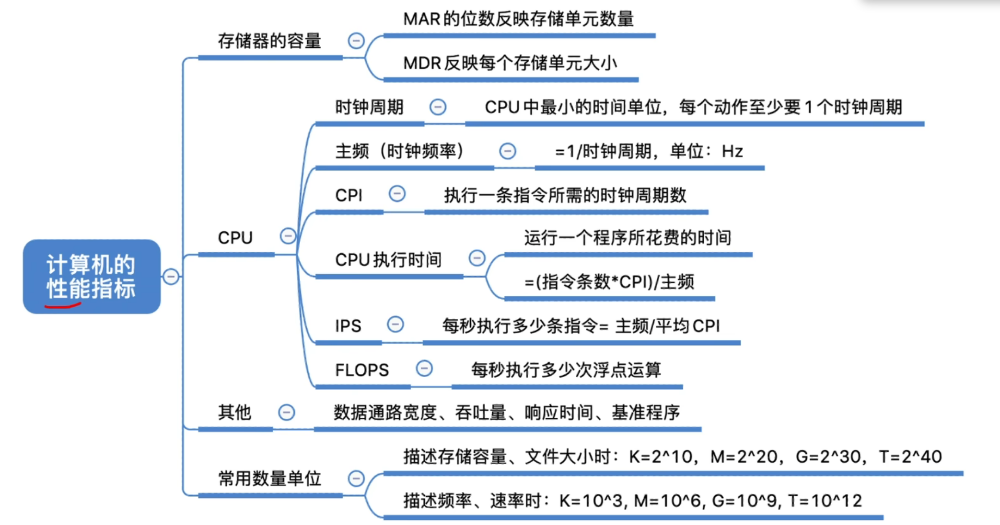

#### cpu的性能指标

+ **主频（时钟频率）** ：cpu中数字脉冲信号震荡的频率，单位为赫兹（Hz），公式为 $\text{CPU主频} = \frac{1}{\text{CPU时钟周期}}$，代表每秒的时钟周期数

+ **CPU时钟周期**：单位为微秒、纳秒，是CPU最小的时间节拍

+ **CPI（Clock cycle Per Instruction）**：执行一条指令所需的时钟周期数

+ **执行一条指令的耗时** = CPI × CPU时钟周期

+ **IPS（Instructions Per Second）**：每秒执行多少条指令，公式为 $\text{IPS} = \frac{\text{主频}}{\text{平均CPI}}$

+ **FLOPS（Floating-point Operations Per Second）**：每秒执行多少次浮点运算

#### 系统整体的性能指标

+ **数据通路带宽**：数据总线一次所能并行传送信息的位数（各硬件部件通过数据总线传输数据）

+ **吞吐量**：指系统在单位时间内处理请求的数量。它取决于信息能多快地输入内存，CPU能多快地取指令，数据能多快地从内存取出或存入，以及所得结果能多快地从内存送给一台外部设备。这些步骤中的每一步都关系到主存，因此，系统吞吐量主要取决于主存的存取周期

+ **响应时间**：指从用户向计算机发送一个请求，到系统对该请求做出响应并获得它所需要的结果的等待时间。通常包括CPU时间（运行一个程序所花费的时间）与等待时间（用于磁盘访问、存储器访问、I/O操作、操作系统开销等时间）

**动态测试**：

+ **基准程序**：是用来测量计算机处理速度的一种实用程序，以便于被测量的计算机性能可被运行相同程序的其它计算机性能进行比较

## 第二章 数据的表示和运算

### 进位计数制

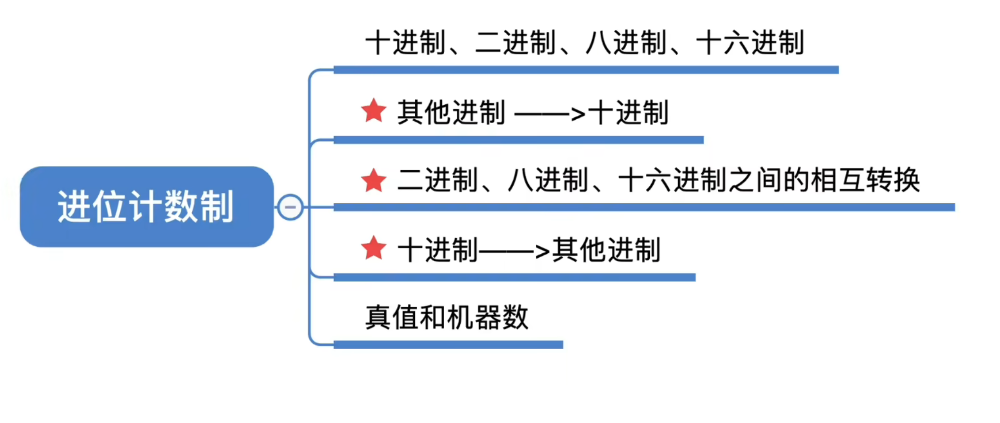

+ **基数**：每个数码位所用到的不同符号的个数，r进制的基数为r

### 定点数的编码表示

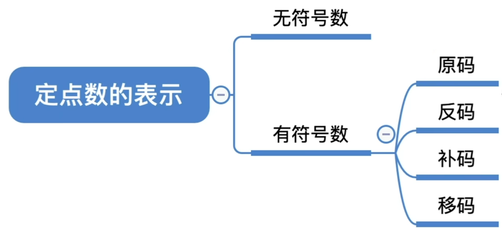

+ **无符号数**：整个机器字长的全部二进制位均为数值位，没有符号位，相当于数的绝对值

+ **n位的无符号数表示范围**：$0 \sim 2^n - 1$

+ **定点整数**：

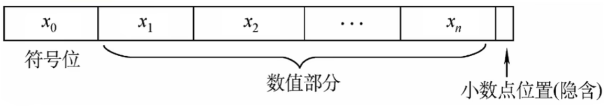

+ 若机器字长为 **n+1 位**（含 1 位符号位、n 位数值位）：
**原码整数的表示范围**：$\boldsymbol{-(2^n - 1) \le x \le 2^n - 1}$（关于原点对称）

+ 真值 0 存在两种表示形式：**+0** 和 **-0**

---

+ **定点小数**：

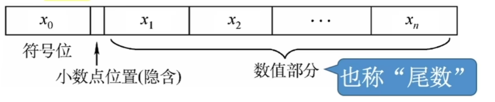

+ 若机器字长为 **n+1 位**（含 1 位符号位、n 位小数位）：
**原码小数的表示范围**：$\boldsymbol{-(1 - 2^{-n}) \le x \le 1 - 2^{-n}}$（关于原点对称）
真值 0 存在两种表示形式：**+0** 和 **-0**

+ **反码**的转换规则：
若符号位为 **0**（正数），则反码与原码**完全相同**。
若符号位为 **1**（负数），则**数值位全部取反**（0变1，1变0），符号位保持为1。

---

+ **补码**的核心规则：
**正数**：补码与原码完全相同（符号位为0，数值位不变）
**负数**：补码 = 反码的末位加 1（计算时要考虑进位，符号位保持为1）

+ 注意：补码的真值0只有一种表示形式。
+ 定点整数补码 $[x]_{\text{补}} = 1,00000000$ 表示 $x = -2^7$。
+ 若机器字长 $n+1$ 位，**补码整数**的表示范围：
  $$-2^n \le x \le 2^n - 1$$
  （比原码多表示一个 $-2^n$）

+ 定点小数补码 $[x]_{\text{补}} = 1.00000000$ 表示 $x = -1$。
+ 若机器字长 $n+1$ 位，**补码小数**的表示范围：
  $$-1 \le x \le 1-2^{-n}$$
  （比原码多表示一个 $-1$）
