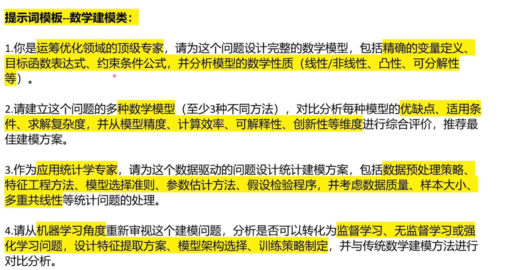
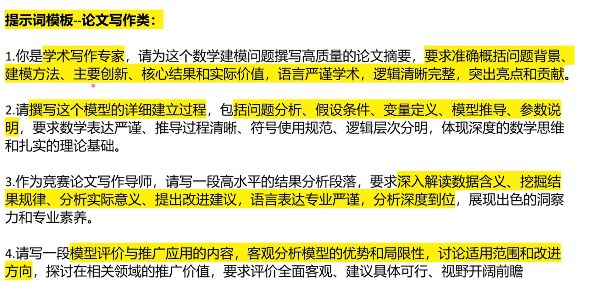
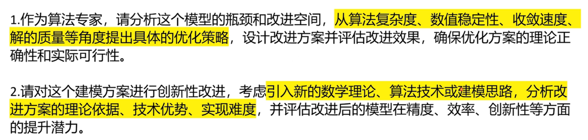
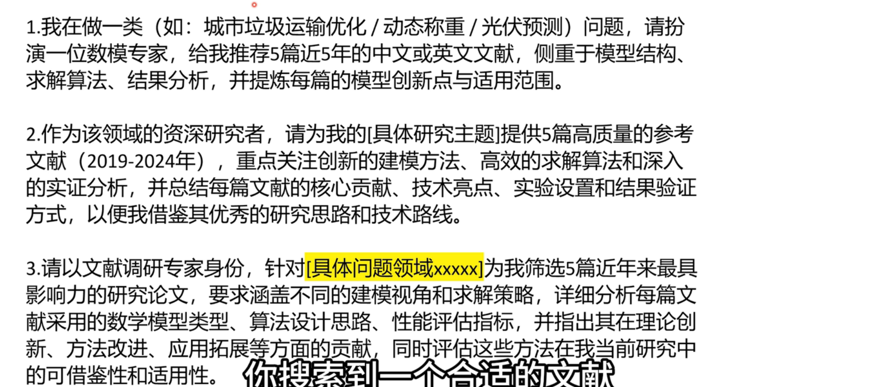
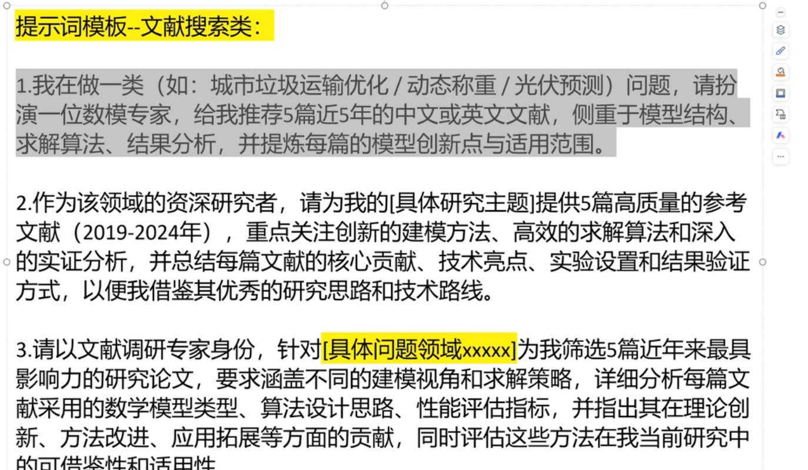

# 数学建模

## ai

### 提示词

## 线性规划（优化类问题）

### 线性规划模型三要素

+ 决策变量：那些变量需要考虑
+ 目标函数
+ 约束条件

### 线性规划适用赛题

……有多少 怎样安排/分配 最大（少）

例：口题目中提到“XXX有多少多少”“怎样安排/分配”“最多（少）”“利润最大”等词，
口生产安排：原材料、设备有限制，总利润最大
·若生产两种机床，利润分别为XXX;A机器和B机器加工，有顺序要求，有不同损耗费用，不同的工作时
间：问题：怎样安排生产使得总利润最大？
口投资收益：涉及资产配置、收益率、损失率、组合投资，总收益最大
。若总资金为M,有n种资产可以配置
。每种资产的平均收益率，风险损失率，手续费；问题：设计组合投资方案，使得收益尽可能大，
总体风险尽可能小（本质是多目标规划，可化简为一个目标的线性规划)
口销售运输：产地、销地、产量、销量、运费，总运费最省
·商品有m个产地和n个销地，需要从产地运到销地
·各产地的产量，各销地需求量由a产地运到b销地的运价xxx;问题：如何调运才能使总运费最省？
车辆安排：路线、起点终点、承载量、时间点、车次安排合理
·不同种类的车辆有各自的承载量，工地各点之间要安排车辆运输
·工地里有多条路线满足用工需求的情况下；问题：如何安排车辆能使产量尽可能大？

#### 标准型

标進型：目标函数最小值约束条件小于等于号或等号如果求最大值怎么办？约束条件有大于等于怎么办？

不满足标准型，两边加-号

## 层次分析法

“知心健康” 商业计划书
一、快速预览：项目摘要
投资亮点与总结
核心产品：“知心健康” 是基于 AI 和智能硬件的个人健康管理平台，通过无创血糖监测手环与 App，提供实时健康监测、AI 健康分析及个性化生活干预方案。
市场机遇：瞄准全球数十亿糖尿病前期及糖尿病患者，以及庞大泛健康管理人群，解决传统血糖监测 “有创、高频次、数据孤立” 的核心痛点。
核心优势：拥有独创的无创血糖监测传感器技术（专利已申请），数据精度领先行业标准；团队由医疗设备、人工智能和消费品营销领域资深专家组成。
融资需求：本轮寻求 500 万人民币天使轮融资，出让 10% 股权，资金主要用于产品量产、团队扩建和市场初步推广。
二、发现痛点
问题
体验差：传统血糖监测需刺破手指采血，带来疼痛和感染风险，导致用户依从性低。
成本高：试纸和采血针为长期消耗品，给患者带来沉重经济负担。
数据孤岛：单次测量数据无法形成连续、动态的健康趋势图，难以用于有效健康管理。
管理滞后：用户无法实时了解食物、运动对血糖的影响，缺乏及时、个性化指导。
市场机会与需求分析
根据国际糖尿病联盟数据，全球有超过 5 亿糖尿病患者，中国患者人数约 1.4 亿，且糖尿病前期人群规模更为庞大。
随着健康意识提升和消费升级，泛健康人群对便捷、智能的日常健康监测工具需求激增，2024 年我国数字化健康管理市场规模已超 2000 亿元，年增 35%。
目标市场规模（TAM）超过千亿级人民币。
三、设计痛点解决方案
解决方案（产品与服务）
核心硬件：“知心” 智能手环
搭载自研的无创血糖监测传感器，可实现 24 小时连续、无痛的血糖水平监测，同时集成心率、血氧、睡眠监测等主流功能，让用户直观感受无创监测的便利。
核心软件：“知心健康” App
实时数据看板：清晰展示血糖曲线及各项健康指标。
AI 健康管家：通过机器学习算法，分析用户血糖数据与饮食、运动、睡眠的关联，预警异常波动。
个性化方案：基于分析结果，提供定制化饮食建议、运动计划和作息提醒。
医生对接平台：用户可授权将数据同步给医生，进行远程问诊和咨询。
四、实现盈利
1. 目标市场
主要市场：中国境内糖尿病患者和糖尿病前期人群（约 3 亿人），该群体月均医疗支出 500-1500 元，重视数据监测与专业指导。
次要市场：关注自身健康的泛健康人群、健身爱好者，其中 18-45 岁普通用户月均健康支出 100-300 元，注重便捷性与性价比。
初期策略：聚焦一线城市，通过与内分泌科室医院和高端体检中心合作，精准获取首批种子用户，预计第一年覆盖 1 万名付费用户。
2. 商业模式
硬件销售收入：“知心” 智能手环首次销售，预计单价 1299 元。
订阅服务收入：App 内 “AI 健康分析报告”“专属干预方案” 等服务采用会员订阅制，月费 59 元 / 月或 599 元 / 年，为未来持续性核心收入来源，参考行业数据，慢病专享会员服务需求增速达 45%。
数据服务收入（远期）：在获得用户授权并脱敏后，为药企、保险机构及科研单位提供匿名的群体健康趋势数据分析服务。
3. 竞争分析
竞争者类型
直接竞争者：A 公司（有创血糖仪厂商）、B 公司（海外无创血糖监测产品，未进入中国）。
间接竞争者：苹果、华为、小米等智能手表厂商（提供泛健康监测，但无专业血糖监测功能）。
核心优势
技术壁垒：拥有核心无创监测专利技术，精度更高。
专业深度：专注血糖健康垂直领域，算法和干预方案更专业，规避了行业内 40% 平台 AI 评估准确率不足 80% 的痛点。
本土化优势：针对中国用户饮食和生活习惯优化算法，服务更接地气。
4. 市场营销
内容营销：在知乎、微信公众号、抖音等平台，持续输出糖尿病防治、健康生活知识，建立专业形象。
KOL 合作：与内分泌领域医生、营养师、健康领域博主合作进行产品评测和推荐，借助医疗专业人士认可加速用户接受进程。
渠道合作：与医院、药店、高端健身房建立合作关系，设立线下体验点，让用户亲身体验产品优势。
数字广告：精准投放至健康、医疗类 App 及社群。
5. 销售渠道
线上：官方商城、天猫 / 京东旗舰店、微信小程序。
线下：医院内医疗器械商店、合作药店、高端电子产品集合店。
6. 发展规划
第一阶段（0-12 个月）：完成产品量产，获取医疗器械注册证（一类），发展 1 万名种子用户，验证商业模式。
第二阶段（13-24 个月）：拓展全国市场，用户数达 10 万，启动二类医疗器械认证申请，深化 AI 算法，参考认证流程，需提前完成产品测试与临床数据准备。
第三阶段（25-36 个月）：开拓海外市场，引入药企和保险合作伙伴，探索数据增值服务。
7. 财务预测（未来 3 年）
项目
第一年
第二年
第三年
硬件销量（台）
10,000
50,000
150,000
付费会员数
5,000
30,000
100,000
总收入（万元）
1,550
5,450
16,450
毛利率
45%
50%
55%
净利润（万元）
-350
850
4,500

（注：此为简化示例，完整 BP 需包含详细的损益表、现金流量表和资产负债表。）
8. 风险预测
风险类型
具体描述
应对策略
技术风险
传感器精度可能受个体差异影响
持续投入研发，建立大规模临床数据库优化算法，参考行业通过用户反馈迭代产品的经验
监管风险
医疗器械认证周期长、要求高
聘请专业法规顾问，尽早启动认证流程，提前准备技术文档与临床数据
市场风险
用户对新产品接受度慢或出现强力竞争者
加强市场教育，通过线上线下结合推广提升认知，快速迭代产品，建立品牌忠诚度
运营风险
供应链中断导致无法按时交货
与多家供应商建立合作关系，备足关键元器件库存

9. 团队
CEO：张三：XX 大学生物医学工程博士，曾任某知名医疗器械公司研发总监，拥有 15 年行业经验。
CTO：李四：XX 科技大学人工智能硕士，曾主导多个智能硬件项目的算法开发。
CMO：王五：拥有 10 年消费品数字营销经验，曾成功操盘多个智能硬件产品从 0 到 1 的落地。
顾问：聘请国内顶尖医院的内分泌科主任医师作为首席医疗顾问，强化专业背书。
10. 融资需求
融资金额：500 万人民币。
出让股权：10%。
资金使用计划：
产品研发与量产（40%）：200 万元，用于完成最终量产版本及备料。
团队扩建（30%）：150 万元，用于招募软件工程师、营销和运营人员。
市场推广（20%）：100 万元，用于初期品牌建设和用户获取。
运营备用金（10%）：50 万元。
