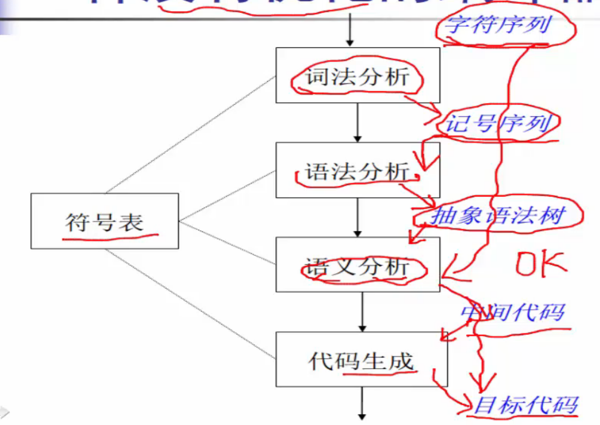
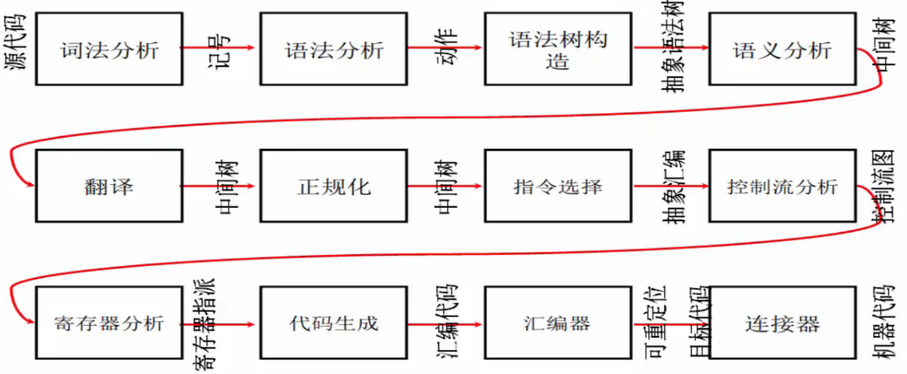
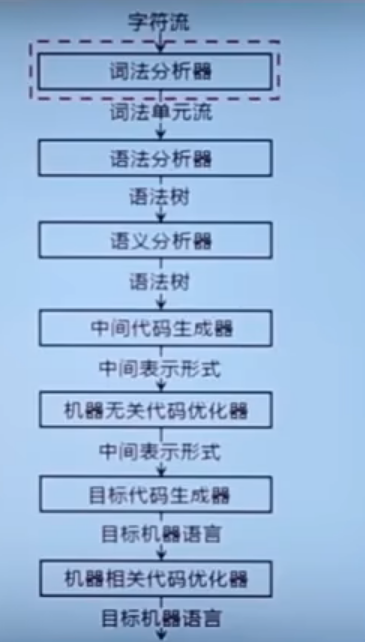

# 编译原理

## 什么是编译

### 汇编

+ 汇编：将汇编语言转换成机器语言

### 编译

+ 编译：将高级语言转换成汇编语言或者将汇编语言转换成机器语言（源语言到目标语言）

## 编译器的高层结构

编译器具有非常**模块化**的高层结构

## 词法分析

**词法分析**：从左向右逐行扫描源程序字符，确定单词的类型。将识别的单词转换成**词法单元**形式（token）

### token

**token**：<种别码，属性值>

| | 单词类型 | 种别 | 种别码 |
| --- | --- | --- | --- |
| 1 | 关键字 | program、if、else、then、... | 一词一码 |
| 2 | 标识符 | 变量名、数组名、记录名、过程名、... | 多词一码 |
| 3 | 常量 | 整型、浮点型、字符型、布尔型、.. | 一型一码 |
| 4 | 运算符 | 算术（+-*/ ++--） 关系（><==!=>=<=） 逻辑（&\|~） | 一词一码或一型一码 |
| 5 | 界限符 | ; 0= 0... | 一词一码 |

## 语法分析

## 语义分析
